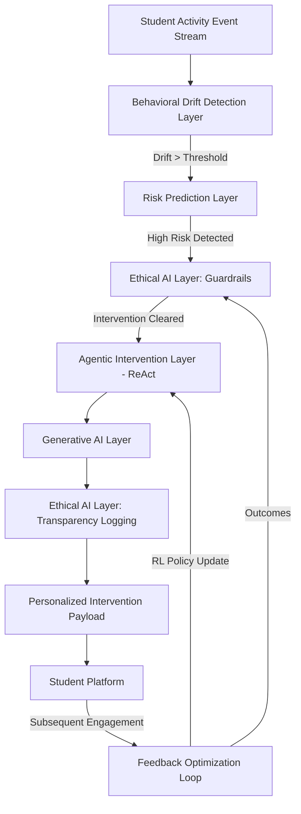

# Agentic AI-Based Dropout Prevention System Architecture

## Overview
This document outlines the high-level architecture of the Agentic AI platform designed to identify and intervene with students at risk of dropping out in an e-learning environment.

## 1. Component Diagram



## 2. Data Flow
1. **Event Capture**: Ongoing interactions (login duration, assignment completion rate, forum posts, video watch time) are captured as feature vectors.
2. **Detection**: `drift_detector.py` maintains an exponential moving average baseline for that student. If the new vector deviates significantly (Z-score > threshold), it passes the vector to the Prediction layer.
3. **Prediction**: `predictor.py` analyzes the vector to output:
   - Dropout probability (XGBoost logic)
   - Engagement decline forecast (LSTM logic)
   - Estimated time remaining (Survival logic)
4. **Ethical Guardrails**: `monitor.py` checks intervention history to prevent notification fatigue. If cleared, proceeds to planning.
5. **Planning**: `agent.py` uses the ReAct framework to reason about the root cause given the state, determine the correct strategy (guided by Reinforcement Learning context), and reflect on past unsuccessful attempts stashed in memory.
6. **Generation**: `generator.py` formats a multi-modal payload: A simplified explanation (if academic struggle), a micro-plan (if time management), or motivation (if engagement drops).
7. **Transparency Logging**: `monitor.py` securely logs the selected action, generated payload, and agent reasoning traces.
8. **Feedback**: `environment.py` (RL Engine) notes the state and action taken. After a period, the student's new drift score acts as the reward signal to update the strategy selection policy. Bias monitoring jobs aggregate this data.

## 3. Backend API Structure (Proposed)
- `POST /api/v1/events`: Ingests raw student clickstream/log data.
- `GET /api/v1/students/{id}/status`: Returns current risk profile and drift score.
- `GET /api/v1/interventions/history`: History of actions taken and their success rate.
- `POST /api/v1/interventions/trigger`: Manually force an intervention generation.

## 4. ML Model Integration Flow
- **Data preprocessing**: Normalization and smoothing.
- **Inference pipeline**: 
  - XGBoost (Tabular features -> `dropout_prob`)
  - LSTM (Sequential baseline -> `engagement_decline`)
  - Survival (Time-to-event -> `days_remaining`)
- **Agent Policy**: Contextual Bandits mapping `[dropout_prob, days_remaining, drift_score]` to `discrete Action space (strategies)`.

## 5. Agent Reasoning Structure (ReAct)
- **Reason**: Formulate a hypothesis about *why* the student is drifting. E.g., "Student's pace dropped drastically while lag increased. This suggests they are stuck on a difficult concept."
- **Act**: Select the appropriate tool/strategy ("Conceptual Breakdown" or "Micro-Plan").
- **Reflect**: Check the student's intervention history memory block. If a "Micro-Plan" failed last week, pivot to "Human Tutor Escalation".

## 6. Demo Simulation Logic
The demo mode (`demo_runner.py`) injects mock scenarios sequentially:
1. **Normal engagement**: Hovering near baseline, low drift.
2. **Gradual decline**: Slow, steady decay in pace and increase in lag. Drift incrementally rises. Predicts dropout far in future. 
3. **Sudden performance drop**: Sharp spike in volatility and lag. Predicts immediate dropout risk. Triggers aggressive ReAct intervention.

## 7. Database Schema (Proposed)
```sql
CREATE TABLE students (
    student_id VARCHAR PRIMARY KEY,
    baseline_vector JSONB,
    current_status VARCHAR
);

CREATE TABLE behavior_logs (
    log_id SERIAL PRIMARY KEY,
    student_id VARCHAR REFERENCES students(student_id),
    timestamp TIMESTAMP,
    pace FLOAT,
    lag FLOAT,
    volatility FLOAT,
    drift_score FLOAT
);

CREATE TABLE interventions (
    intervention_id SERIAL PRIMARY KEY,
    student_id VARCHAR,
    strategy_used VARCHAR,
    generated_payload TEXT,
    timestamp TIMESTAMP,
    success_score FLOAT, -- Populated later by RL feedback loop
    reasoning_trace TEXT
);
```
