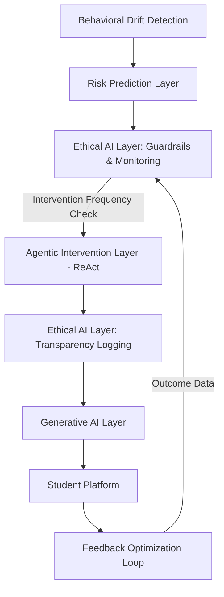

# Ethical AI Layer Design

## 1. Overview
The Ethical AI Layer acts as a governance and oversight module within the Agentic Dropout Prevention System. Its primary goal is to ensure that autonomous interventions are distributed fairly across all student demographics, that the system doesn't overwhelm students with notifications (fatigue), and that all agentic reasoning traces are logged for transparency and auditing.

## 2. Architecture Integration
The Ethical AI Layer wraps around the existing ReAct Planner and Generative AI Layers. 



**Workflow Integration:**
1. **Pre-Intervention (Frequency Control):** Before the ReAct Agent is allowed to formulate a plan, the Ethical AI Layer checks the student's intervention history. If the student has reached a fatigue threshold, the intervention is blocked or downgraded to a passive notification.
2. **Post-Intervention (Transparency):** Every generated action, along with the Agent's reasoning trace and contributing features, is forwarded to the Transparency Logs.
3. **Batch Monitoring (Bias & False Positives):** A nightly scheduled job reads the outcomes from the Feedback Optimization Loop and the Transparency Logs to calculate Demographic Parity, Equal Opportunity Difference, and False Alert Rates.

## 3. Data Schema Additions

To support auditing and fairness tracking, we inject demographic and outcome data into the reporting schemas.

```sql
-- Existing Student Table augmented with protected attributes
ALTER TABLE students ADD COLUMN gender VARCHAR;
ALTER TABLE students ADD COLUMN socio_economic_band VARCHAR;
ALTER TABLE students ADD COLUMN prior_academic_tier VARCHAR;

-- New Transparency Audit Log
CREATE TABLE transparency_logs (
    log_id SERIAL PRIMARY KEY,
    student_id VARCHAR REFERENCES students(student_id),
    timestamp TIMESTAMP,
    risk_score FLOAT,
    top_contributing_features JSONB,
    selected_strategy VARCHAR,
    agent_reasoning_trace TEXT,
    human_override BOOLEAN DEFAULT FALSE
);

-- New Intervention Tracking (For Fatigue & Outcomes)
CREATE TABLE intervention_tracking (
    intervention_id SERIAL PRIMARY KEY,
    student_id VARCHAR REFERENCES students(student_id),
    timestamp TIMESTAMP,
    strategy VARCHAR,
    did_student_dropout_ultimately BOOLEAN, -- Used for False Positives
    dropout_date TIMESTAMP NULL
);
```

## 4. Monitoring Dashboard Design

The Ethical Oversight Dashboard provides administrators and academic counselors with a macro-view of the AI's behavior.

### Panel 1: Fairness & Bias Matrices
- **Demographic Parity Chart:** A bar chart comparing the percentage of interventions triggered for Group A (e.g., Low Income) vs. Group B (e.g., High Income).
- **Equal Opportunity Meter:** A gauge comparing the true positive rate across gender/academic bands. "Are we equally accurately identifying at-risk students across all groups, or is the model over-flagging male students?"

### Panel 2: False Positive Tracking
- **False Alert Rate (FAR) Trendline:** A line graph mapping the percentage of "High Risk" predictions that resolved naturally without an intervention *or* where the student graduated successfully despite flags.
- **Alert Fatigue Heatmap:** A visual matrix showing student segment vs. average notifications per week.

### Panel 3: Transparency Audit Feed
- A scrolling, searchable ledger.
- *Columns*: Timestamp | Student ID | Risk Score | Agent Diagnosis | Action Taken | SHAP Highlights
- Allows an auditor to click any row and see the exact LLM prompt and output that was sent to the student.

## 5. Example Fairness Report Output

Below is an example of the JSON payload generated by the nightly batch job calculating bias and false positive metrics over the trailing 30 days.

```json
{
  "report_date": "2026-03-01",
  "window_days": 30,
  "total_interventions": 1450,
  "bias_metrics": {
    "gender": {
      "demographic_parity": {
        "female_intervention_rate": 0.12,
        "male_intervention_rate": 0.14,
        "parity_difference": 0.02,
        "status": "PASS - WITHIN ALLOWABLE THRESHOLD"
      },
      "equal_opportunity": {
        "female_true_positive_rate": 0.88,
        "male_true_positive_rate": 0.85,
        "eod_difference": 0.03,
        "status": "PASS - BALANCED ACCURACY"
      }
    },
    "socio_economic_group": {
      "demographic_parity": {
        "band_A_low_income_rate": 0.22,
        "band_B_high_income_rate": 0.08,
        "parity_difference": 0.14,
        "status": "FAIL - INVESTIGATE POTENTIAL OVER-FLAGGING OF BAND A"
      }
    }
  },
  "false_positive_monitoring": {
    "total_high_risk_flags": 340,
    "flags_resolved_without_dropout": 85,
    "false_alert_rate": 0.25,
    "trend_vs_last_month": "-0.04"
  },
  "intervention_frequency": {
    "average_per_student_per_month": 1.2,
    "students_hitting_fatigue_cap": 24,
    "interventions_blocked_by_guardrail": 45
  }
}
```

## 6. Intervention Frequency Control Logic (Pseudocode)

```python
def check_intervention_fatigue(student_id, memory_history, max_per_week=2, max_per_month=4):
    """
    Evaluates if a student has received too many interventions recently to prevent notification fatigue.
    """
    now = current_time()
    
    # Filter memory for recent timestamps
    past_7_days = [m for m in memory_history if (now - m.timestamp).days <= 7]
    past_30_days = [m for m in memory_history if (now - m.timestamp).days <= 30]
    
    if len(past_7_days) >= max_per_week:
        return True, "Fatigue Cap Reached: 7-Day Limit Allowed"
        
    if len(past_30_days) >= max_per_month:
        return True, "Fatigue Cap Reached: 30-Day Limit Allowed"
        
    return False, "Clear to Intervene"
```
