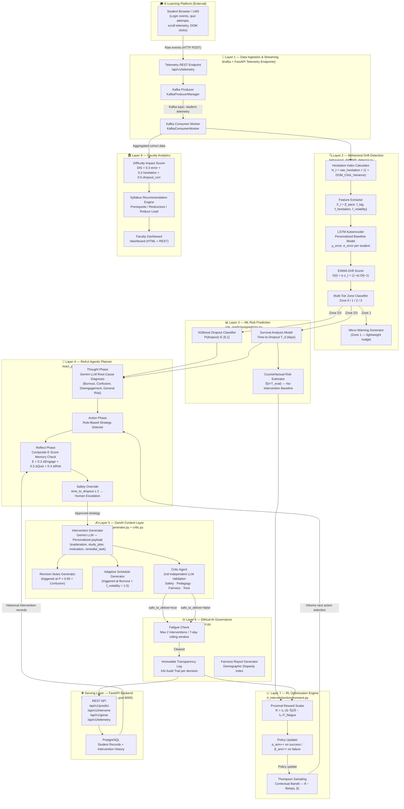

# Patent Claims: StudyShield — Agentic AI Dropout Prevention System

**Applicant:** StudyShield Research Team  
**Filing Date:** 2026-03-06  
**Technology Domain:** Artificial Intelligence, Educational Technology (Ed-Tech), Adaptive Learning Systems

---

## Overview

This document formalizes the novel, non-obvious, and industrially applicable inventive contributions of the **StudyShield** system — an end-to-end Agentic AI pipeline for real-time student dropout prediction, root-cause diagnosis, and closed-loop intervention optimization in e-learning platforms. The system is distinguishable from prior art in seven independently patentable clusters, each described by independent and dependent claims below.

---

## System Architecture

### Architecture Overview

StudyShield is composed of **eight vertically stacked, loosely coupled layers**. Raw student interaction events enter at the bottom (Data Ingestion) and flow upward through streaming, ML prediction, agentic reasoning, generative content, and ethical governance, ultimately producing personalized interventions delivered through the API serving layer and faculty-facing analytics.

---

### Component Layer Reference

| Layer | Module / File | Technology | Novel Patent Claim |
|---|---|---|---|
| **0 — E-Learning Source** | External LMS / Browser | Any HTTP client | — |
| **1 — Streaming Ingestion** | `backend/streaming/producer.py` · `consumer_worker.py` | FastAPI · Apache Kafka | — |
| **2 — Drift Detection** | `behavioral_drift/drift_detector.py` | PyTorch LSTM · NumPy EWMA | **Claims 1 & 2** |
| **3 — Risk Prediction** | `risk_prediction/predictor.py` | XGBoost · Survival Analysis · Counterfactual | Supporting layer |
| **4 — ReAct Agent** | `react_planner/agent.py` | Gemini LLM · Deterministic heuristics | **Claim 3** |
| **5 — GenAI Content** | `genai_layer/generator.py` · `critic.py` | Gemini LLM (Dual-agent) | **Claim 4** |
| **6 — Ethical Governance** | `ethical_ai/monitor.py` | Pure Python append-only log | **Claim 7** |
| **7 — RL Optimization** | `rl_intervention/environment.py` | Thompson Sampling / Contextual Bandit | **Claim 5** |
| **8 — Faculty Analytics** | `course_analytics/analytics.py` | Weighted aggregation model | **Claim 6** |
| **9 — Serving Layer** | `backend/main.py` | FastAPI · PostgreSQL · Uvicorn | — |

---

### End-to-End Data Flow (Narrative)

1. **Ingestion:** A student's browser emits raw interaction events (login, scroll, click, quiz attempt) to the FastAPI telemetry endpoint, which publishes them to a Kafka topic.
2. **Drift Detection:** The Kafka consumer feeds events into the `BehavioralDriftDetector`, which extracts the 4-dimensional behavioral vector `X_t`, computes the proprietary Hesitation Index `H_t`, runs it through the LSTM Autoencoder, and produces a smoothed Drift Score `D(t)`.
3. **Zone Routing:** `D(t)` is classified into one of four zones. Zone 1 triggers a lightweight Micro-Warning autonomously. Zones 2–3 escalate to the full ML + Agent pipeline.
4. **ML Risk Quantification:** The `DropoutPredictor` runs XGBoost to compute `P(dropout)` and a Survival Analysis model to estimate `T_d` (days until dropout). A counterfactual baseline `Ŝ` is also computed for RL reward use.
5. **Agentic Planning (ReAct Loop):** The `ReActPlanner` runs three sequential phases:
   - **Thought** — LLM diagnoses the root psychological cause.
   - **Act** — deterministic strategy selection.
   - **Reflect** — memory-based effectiveness check with automatic escalation if `E_score < 0.4`.
   - **Safety Override** — forces `human_escalation` if `T_d ≤ 2`.
6. **GenAI Content Generation + Critic Validation:** The `InterventionGenerator` calls Gemini to produce a personalized payload. The `CriticAgent` independently validates it across four axes and either approves or replaces it with a safe fallback.
7. **Ethical Gate:** The `EthicalMonitor` checks intervention frequency (max 2/week) and logs the full reasoning trace for XAI compliance before allowing delivery.
8. **Delivery & RL Feedback:** The approved payload is delivered via the REST API and stored in PostgreSQL. After `T_eval` days, the `ContextualBanditRLEngine` computes `R_intervene` and updates the Thompson Sampling policy.
9. **Faculty Analytics:** Cohort-level aggregated telemetry is continuously fed into the `CourseIntelligenceModule`, which surfaces high-DIS topics and pedagogical recommendations to faculty via the `/dashboard` endpoint.

---

## Claim Set 1: Personalized Behavioral Drift Detection via LSTM Autoencoder and EWMA Smoothing

### Background & Novelty
Prior systems in educational analytics classify students against global cohort averages, which are susceptible to dataset skew and fail to account for individual behavioral baselines. This invention establishes a **per-student, per-session** baseline using an LSTM Autoencoder trained on the student's own historical peak-performance period, and derives a continuously smoothed **Normalized Drift Score D(t)** through Exponentially Weighted Moving Averaging (EWMA).

### Independent Claim 1.1
A computer-implemented method for detecting behavioral drift in an e-learning platform comprising:

1. Collecting a sequence of behavioral telemetry vectors `X_t = [f_pace, f_lag, f_hesitation, f_volatility]` for a student over a sliding baseline window of configurable length (e.g., 14 days).
2. Training an LSTM Autoencoder network on the student's own historical baseline data to establish a personalized normal reconstruction-error mean (μ_error) and standard deviation (σ_error).
3. For each new daily telemetry vector `X_t`, computing an instantaneous deviation score `d_t` as the L2 reconstruction error of the most recent timestep using said trained autoencoder.
4. Computing a Z-score normalized deviation: `z_t = (d_t − μ_error) / σ_error`.
5. Applying EWMA to produce a smoothed Drift Score `D(t) = α · z_t + (1 − α) · D(t−1)`, where `α` is a configurable decay factor (default 0.3).
6. Classifying D(t) into a multi-tiered alert zone: Zone 0 (Nominal: D ≤ 1.5), Zone 1 (Micro-Drift: 1.5 < D ≤ 2.5), Zone 2 (Structural Drift: 2.5 < D ≤ 3.5), Zone 3 (Critical Rupture: D > 3.5).

### Dependent Claim 1.2 — Autonomous Micro-Warning System
The method of Claim 1.1, further comprising generating a lightweight, template-based intervention message (*Micro-Warning*) autonomously for Zone 1 drift **without invoking** the full ReAct reasoning or GenAI pipeline, thereby minimizing computational overhead and intervention latency. The micro-warning is parameterized by the specific dominant anomalous feature (e.g., pace drop → encouragement nudge; lag > 2 days → assignment backlog reminder; high volatility → automatic 24-hour deadline extension).

---

## Claim Set 2: Hesitation Index Algorithm — Cognitive Burden Telemetry Extraction

### Background & Novelty
Standard engagement metrics (login frequency, session duration) cannot distinguish between a student actively consuming content versus one passively staring at a screen while cognitively blocked. This invention introduces a proprietary telemetry extraction formula that isolates **Active Hesitation Time** from **Idle Time**, and amplifies it by erratic interaction behavior (DOM click variance) to produce a proxy metric for cognitive overload or burnout at the individual session level.

### Independent Claim 2.1
A computer-implemented method for computing a **Hesitation Index (H_t)** from browser-level session telemetry comprising:

1. Extracting from a student's learning session:
   - `T_on_screen`: total time (seconds) the learning content page was in active focus.
   - `T_active_scrolling`: total time (seconds) during which detectable mouse movement, scroll events, or keyboard input were registered.
   - `DOM_Click_Variance`: the statistical variance of non-productive click events (e.g., repeated text-highlighting, rapid repetitive re-clicks without navigation) within the session.
2. Computing raw hesitation time: `raw_hesitation = max(0, T_on_screen − T_active_scrolling)`.
3. Amplifying by erratic behavior: `H_t = raw_hesitation × (1 + DOM_Click_Variance)`.
4. Incorporating `H_t` as the `f_hesitation` component of the behavioral telemetry vector `X_t` fed into the Drift Score calculation of Claim 1.1.

### Dependent Claim 2.2
The method of Claim 2.1, wherein `DOM_Click_Variance` is computed as the variance of inter-click intervals for click events that do not result in a page navigation, form submission, or modal interaction, specifically isolating semantically non-progressive clicks as a proxy for cognitive stalling behavior.

---

## Claim Set 3: Agentic ReAct (Reason → Act → Reflect) Intervention Planner with Reflective Memory Constraint

### Background & Novelty
Existing rule-based or model-output-driven intervention systems directly map risk scores to pre-defined action templates. This invention implements a fully autonomous **ReAct (Reason-Act-Reflect) Agent** as a decoupled mediator layer between the risk prediction models and the generative content layer. The agent performs an LLM-powered root cause diagnosis, selects a strategy, consults a localized intervention memory store, and **pivots strategies automatically** if prior attempts for the same student have failed — all without human rule updates.

### Independent Claim 3.1
A computer-implemented system for autonomous educational intervention planning comprising:

1. **Thought Phase:** Upon receiving a `StudentState` object containing `{D(t), X_t, dropout_probability, time_to_dropout, intervention_history}`, invoking a first Large Language Model (LLM) call to diagnose the primary root psychological cause, selecting from: `{Burnout, Confusion/Cognitive Overload, Disengagement/Apathy, General Risk}`, by reasoning over the feature vector in a structured JSON response schema.
2. **Action Phase:** Mapping the diagnosed root cause to a baseline intervention strategy via a deterministic heuristic rule set (`{Burnout → schedule_restructure, Confusion → content_simplification, Disengagement → micro_nudge}`).
3. **Reflect Phase:** Querying a per-student in-memory `intervention_history` log and computing a **Composite Historical Effectiveness Score** for the proposed strategy using the formula:  
   `E_score = 0.3 · norm_Δengagement + 0.3 · norm_Δquiz + 0.4 · norm_Δrisk_reduction`  
   wherein normalization bounds are configurable parameters.  
4. If `E_score < 0.4` for any prior attempt of the proposed strategy, automatically pivoting to the next-escalated intervention in the deterministic pivot chain: `micro_nudge → peer_sync → content_simplification → schedule_restructure → human_escalation`.

### Dependent Claim 3.2 — Time-Critical Safety Override
The system of Claim 3.1, further comprising overriding all Thought, Act, and Reflect phases and forcing immediate selection of `human_escalation` when the Survival Analysis model predicts `time_to_dropout ≤ 2 days`, ensuring no exploratory decisions are made under critical urgency conditions.

### Dependent Claim 3.3 — Contextual Trigger: Adaptive Outputs
The system of Claim 3.1, further comprising automatically appending supplementary generated artifacts to the intervention payload based on compound trigger conditions:
- Generating **personalized revision notes** (structured key concepts, simplified explanation, step-by-step examples, and revision checklist) when `dropout_probability > 0.65` AND the diagnosed cause is `Confusion/Cognitive Overload`.
- Generating an **adaptive weekly schedule restructuring** artifact when the diagnosed cause is `Burnout` AND the volatility feature `f_volatility > 1.5`, reducing load and deferring non-critical topics to a later period.

---

## Claim Set 4: Multi-Agent Validation Protocol — LLM Generator + Safety Critic Architecture

### Background & Novelty
Single-model generative AI systems for student communication carry risks of producing pedagogically unsound, demographically biased, or psychologically harmful content — particularly when operating on vulnerable at-risk learners. This invention implements a **two-model, producer-critic Multi-Agent Validation Protocol** where a second independent LLM instance acts as a mandatory safety gatekeeper, evaluating every generated intervention across four axes before delivery is authorized.

### Independent Claim 4.1
A multi-agent computer-implemented system for safe delivery of AI-generated educational interventions comprising:

1. A **Generator Agent** that produces a structured intervention payload of the form `{explanation, study_plan, motivation, remedial_task}` personalized to the student's diagnosed psychological state and intervention strategy.
2. A **Critic Agent** that executes a second, independent LLM call receiving: (a) the complete Generator output, (b) student context `{risk_score, dropout_archetype, demographic_group}`, and evaluating the payload against four mandatory criteria:
   - **Pedagogical Soundness:** Whether the advice is educationally evidence-based.
   - **Demographic Fairness:** Whether the message treats the student equitably regardless of socioeconomic, geographic, or ethnic background.
   - **Professional Tone:** Whether the message is compassionate, non-condescending, and motivating.
   - **Actionability:** Whether the `remedial_task` field is achievable within 30 minutes.
3. The Critic Agent returning a structured verdict `{verdict: "pass"|"fail", reasoning, safe_to_deliver: bool, suggested_revision}`.
4. Replacing the Generator's payload with a safety fallback message and the `suggested_revision` text if `safe_to_deliver == false`, ensuring no unvalidated content reaches the student.

### Dependent Claim 4.2 — Heuristic Fallback Validation
The system of Claim 4.1, further comprising a deterministic rule-based fallback validation mechanism that activates when the Critic LLM API is unavailable, enforcing minimum content length thresholds, non-empty required fields, and phrase-level toxicity filtering against a configurable catalog of flagged expressions.

---

## Claim Set 5: Proximal Reward Scalar for Reinforcement Learning in Delayed-Label Educational Environments

### Background & Novelty
Standard RL reward functions require observable terminal outcomes (dropout or graduation) which in educational settings are delayed by weeks or months, making direct RL training infeasible in production. This invention defines a **Proximal Reward Scalar (R_intervene)** that bridges delayed survival analysis predictions with immediate, observable post-intervention behavioral signals via a **counterfactual comparison framework**.

### Independent Claim 5.1
A reinforcement learning reward formulation for educational intervention optimization comprising:

1. After delivering an intervention, observing the student's actual post-intervention survival probability `S(t + T_eval)` at a configurable evaluation horizon `T_eval` (e.g., 3 days after intervention).
2. Computing a counterfactual baseline survival probability `Ŝ(t + T_eval)` representing the system's estimate of the student's survival probability **had no intervention been delivered**, derived from the survival analysis model using pre-intervention features.
3. Computing the **Proximal Retention Gain**:  
   `retention_gain = (S(t + T_eval) − Ŝ(t + T_eval)) / Ŝ(t + T_eval)`
4. Computing the **Intervention Fatigue Penalty** `P_fatigue` as the count of interventions delivered to the student within the past configurable rolling window (e.g., 7 days).
5. Computing the **Proximal Reward Scalar**:  
   `R_intervene = λ₁ · retention_gain − λ₂ · P_fatigue`  
   where `λ₁` (default 1.0) weights the positive retention signal and `λ₂` (default 0.5) penalizes over-intervention fatigue, both being configurable hyperparameters.
6. Applying `R_intervene` to update the Thompson Sampling Beta-distribution parameters for the selected action arm: incrementing `α_arm` on success (`R_intervene > 0`) and `β_arm` on failure, thereby adapting the global contextual bandit policy across cohorts.

### Dependent Claim 5.2 — Thompson Sampling Contextual Bandit Integration
The method of Claim 5.1, wherein action selection prior to reward observation is performed by sampling from per-action Beta distributions `θ_arm ~ Beta(α_arm, β_arm)` and selecting `argmax(θ)`, enabling Bayesian uncertainty-aware exploration-exploitation balancing of the intervention action space `{micro_nudge, content_simplification, schedule_restructure, peer_sync, human_escalation}`.

### Dependent Claim 5.3 — Safety-Bound Exploration Override
The method of Claim 5.1, further comprising suppressing all Thompson Sampling exploration and forcing deterministic selection of `human_escalation` when the Survival Analysis model predicts `time_to_dropout < 2 days`, preventing the RL engine from exploring lower-confidence interventions when student retention is critically imminent.

---

## Claim Set 6: Course-Level Cohort Intelligence — Aggregate Difficulty Impact Scoring for Syllabus Diagnosis

### Background & Novelty
Existing ed-tech platforms process student analytics at the individual level and miss systemic, course-structural problems that affect entire cohorts. This invention aggregates individual-level telemetry (hesitation, quiz error rates, session volatility) at the topic level across all enrolled students, computing a proprietary **Difficulty Impact Score** to autonomously pinpoint pedagogically failing course modules and recommend targeted faculty interventions.

### Independent Claim 6.1
A computer-implemented method for cohort-level course difficulty diagnosis comprising:

1. Aggregating, for each course topic, the following cohort-wide telemetry signals from all enrolled students: average quiz `error_rate ∈ [0,1]`, `hesitation_ratio` (mean session hesitation relative to the platform baseline), and `dropout_correlation` (Pearson or Spearman correlation coefficient between topic engagement drop and subsequent student dropout events).
2. Computing a composite **Difficulty Impact Score (DIS)**:  
   `DIS = 0.3 · error_rate + 0.2 · norm_hesitation + 0.5 · dropout_correlation`  
   where `norm_hesitation = min(1.0, max(0.0, (hesitation_ratio − 1.0) / 4.0))`, and the weights are configurable parameters with documented pedagogical rationale.
3. For topics where `DIS ≥ 0.6`, applying a deterministic policy mapping to a recommended faculty action:  
   - `hesitation_ratio > 3.0` → **Add Prerequisite Modules** (foundational knowledge gap).  
   - `error_rate > 0.7 AND hesitation_ratio < 1.5` → **Restructure & Add Practicals** (misconception in material framing).  
   - Default → **Reduce Content Load** (structural overload).
4. Surfacing the diagnosis, DIS value, breakdown metrics, and generated rationale on a faculty-facing dashboard for human-in-the-loop decision making.

---

## Claim Set 7: Ethical AI Governance Layer — Fatigue-Constrained Intervention Throttling and Immutable Audit Trail

### Background & Novelty
Unconstrained AI intervention systems risk notification fatigue, violation of student autonomy, and lack of regulatory audit capability. This invention introduces a dedicated **Ethical AI Governance Layer** operating as a mandatory pre-flight check upstream of all intervention delivery, with configurable frequency limits and an append-only transparency log.

### Independent Claim 7.1
A computer-implemented ethical governance system for AI-driven student interventions comprising:

1. A **Fatigue Check** mechanism that, before any intervention delivery, counts the number of interventions delivered to the target student within a configurable rolling window (default 7 days) and blocks delivery if this count meets or exceeds a configurable maximum (default 2 per week), returning a structured `{blocked: true, reason}` signal to the upstream agent.
2. An **Immutable Transparency Log** that records an audit entry for every intervention decision — whether delivered or blocked — containing: `{timestamp, student_id, risk_score, top_contributing_features, agent_diagnosed_cause, selected_strategy}`, providing a complete, human-readable XAI (Explainable AI) trail for regulatory compliance and educator review.
3. A **Fairness Report Generator** that periodically aggregates logged decisions and cross-references with student demographic metadata to compute a demographic disparity index, surfacing potential systematic bias in intervention frequency or escalation rates across protected groups.

---

## Summary of Novel Contributions

| Claim Set | Component | Key Novel Element |
|---|---|---|
| 1 | LSTM Autoencoder + EWMA Drift Score | Per-student personalized baseline; tiered Z-score alerting |
| 2 | Hesitation Index Algorithm `H_t` | Isolation of active hesitation from idle time + DOM click variance amplification |
| 3 | ReAct Planner + Reflective Memory | LLM diagnosis + composite E-score driven automatic strategy pivoting |
| 4 | Multi-Agent Validation Protocol | Two-LLM producer-critic safety gating for all generated content |
| 5 | Proximal Reward Scalar `R_intervene` | Counterfactual survival comparison for RL training in delayed-label domains |
| 6 | Cohort Difficulty Impact Score | Aggregate telemetry → topic-level DIS → automated syllabus fault detection |
| 7 | Ethical Governance + Fatigue Control | Configurable throttling + immutable XAI audit log + fairness reporting |

---

*All claim sets describe implementations whose core logic is fully realized in the StudyShield codebase under modules `behavioral_drift/`, `react_planner/`, `rl_intervention/`, `genai_layer/`, `course_analytics/`, and `ethical_ai/`, as of filing date 2026-03-06.*
